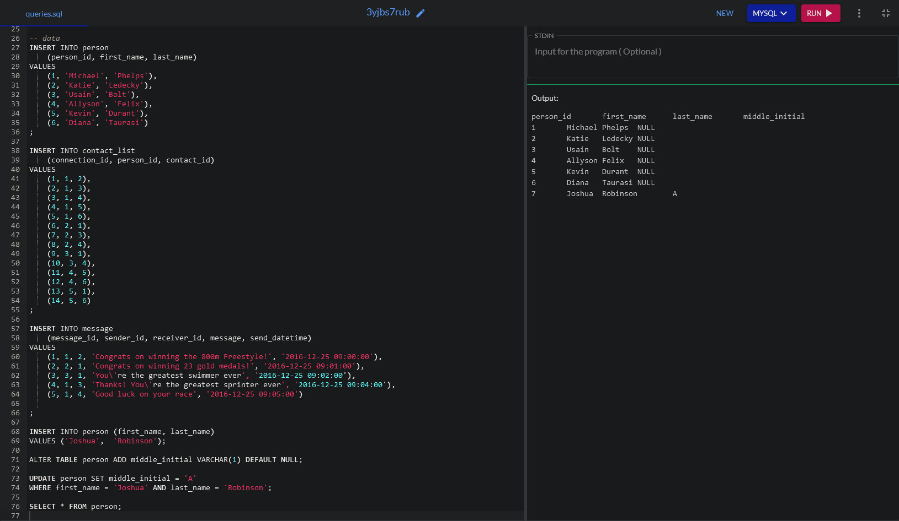
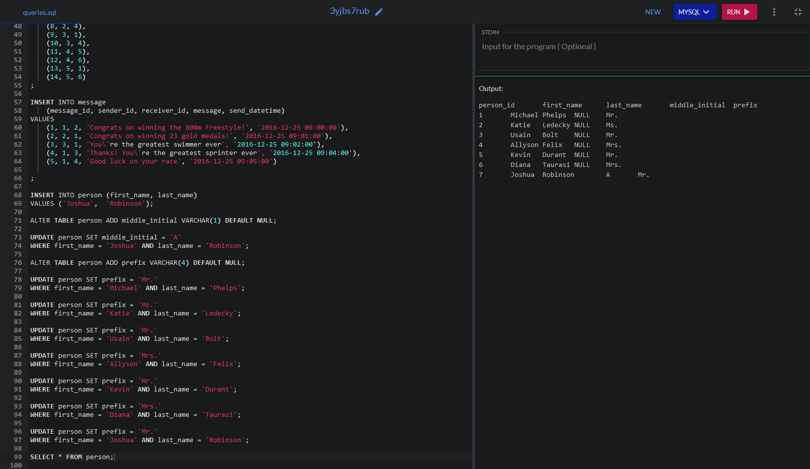
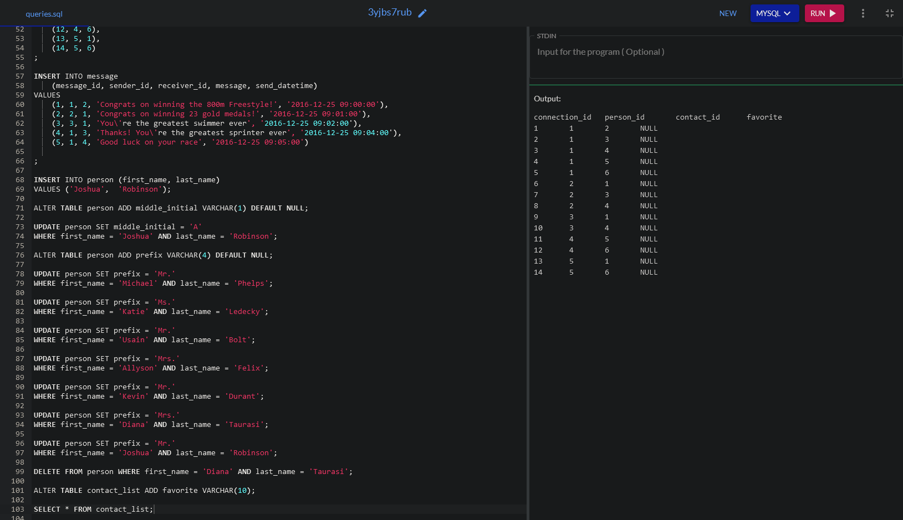
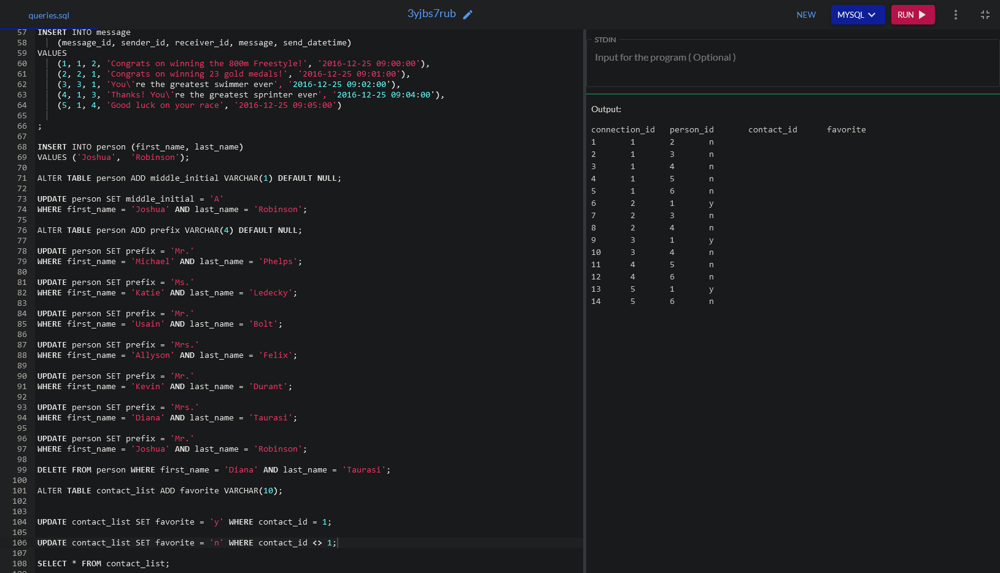
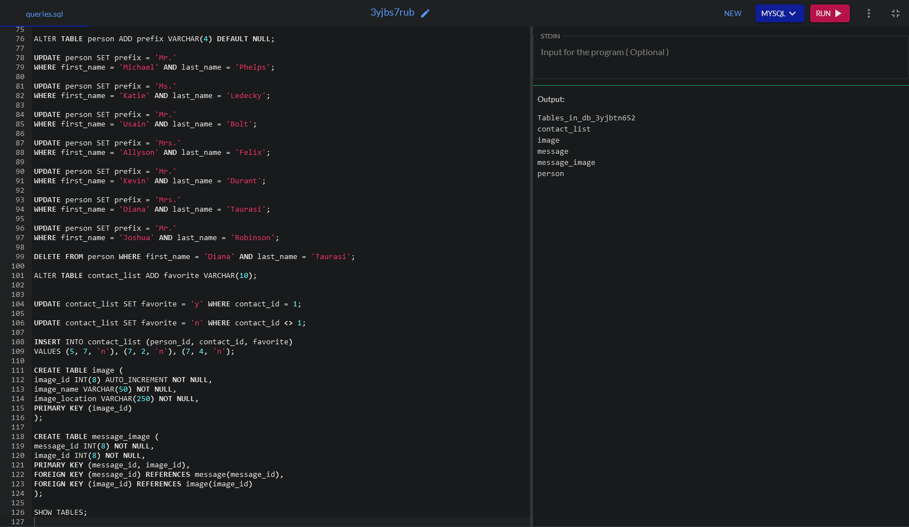
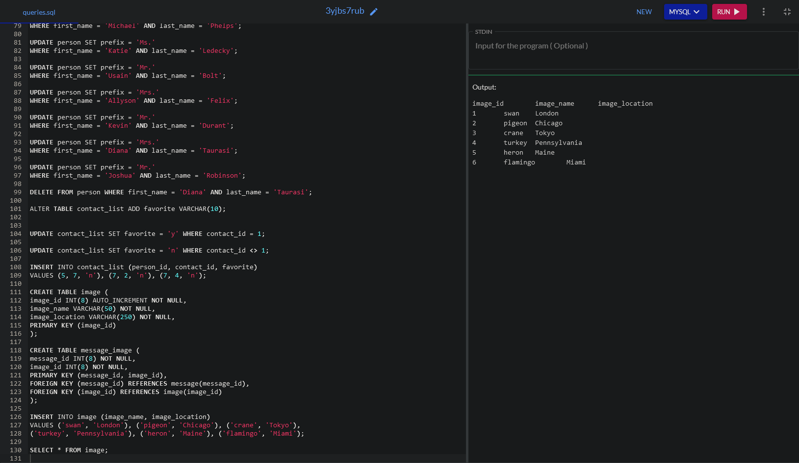
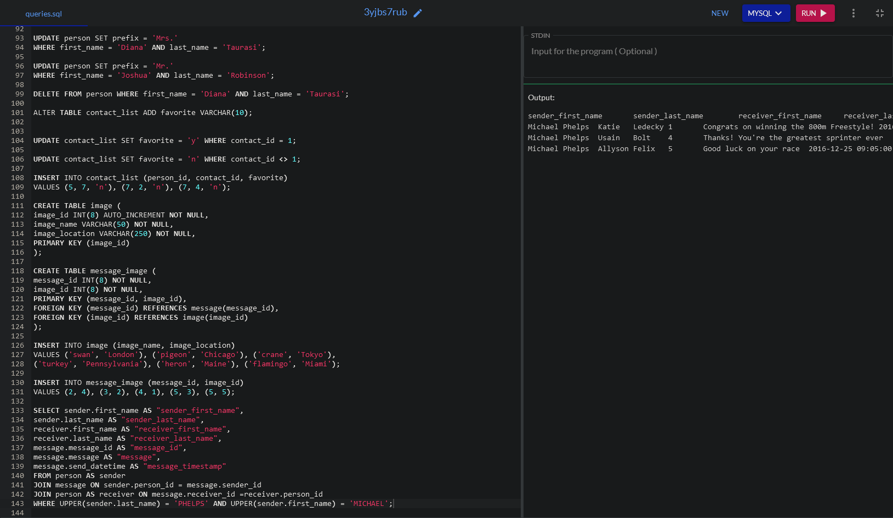
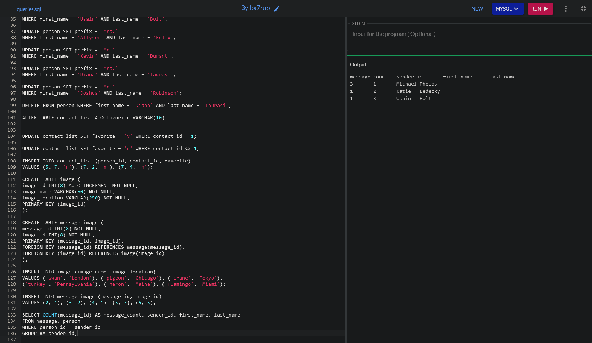

# Introduction

My name is Joshua Robinson. I have come to the end of my studies and will be earning my bachelor degree in Computer Science from Southern New Hampshire University.  Welcome to my ePortfolio. I have highlighted 3 specific artifacts in the areas of Software design and engineering, Algorithms and data structure, and Databases from a few of my classes I completed while studying at SNHU. As you can see, I have each category linked with a narrative that explains the artifact and what I earned, found challenging, and enhancements to demonstrate learning beyond the scope of the class. Moving forward, I plan to pursue a career in the field of IT or programming. Once I have graduated, I will search in earnest for the position that fits me.

## Self-Reflection

The Computer Science program at SNHU helped me to develop and hone skills relative to the field. I came into the program with an associate degree in Architectural Engineering. This wasn’t really all that useful in the program as it related to content specific course requirements. I was able to use the course work credits towards the core requirements for the SNHU’s computer science degree. There were many aspects of this course of study that seemed pretty easy for me. I felt that I had a great amount of tacit knowledge and some cursory background experience with some of the programming language and a basic understanding of the roadmap from point A to point B.

What seemed most trying for me was feeling like I was missing something in the details. I always felt a great sense of accomplishment when I completed a task that taught me a necessary skill for moving forward or added another tool to my toolbox. When I think about the specifics of the program, the most difficult classes offered me the most growth. I found that the action of coding and designing were most fulfilling for me in terms of learning and enhancing my knowledge base. There were times when I wished there was more to do, more hands-on activities and more applied learning.

Although I understand the importance of writing, I was most comfortable when pushing myself with other aspects of the course work. For example, in the UI/UX design class, I was very excited to learn about app programs and thoroughly enjoyed the design aspect of the course. What gave me the most challenge was the detail in the tangential topics. It would have been most advantageous for me to have an opportunity to put some design skills to the test in application.
Most specifically, I feel that any task that required me to pay attention to detail, in coding mostly, was where I was able to showcase my abilities. I was drawn to the minute aspects of coding. For example, making sure there weren’t unnecessary spaces, or misspelled words. It was sometimes a puzzle that was missing that one little piece.

The various platforms MongoDB, Python, C++, Java, and MySQL, although all different for different purposes, the small level of knowledge that I had prior to this degree program gave me the basic ability to move forward with a little less trepidation.

The most collaboration I felt was relative to the class where I used Git. In this class, I interacted with version control, where I was able to track changes in a collaborative manner. Speaking from a non-technical sense, using version control was beneficial in terms of time management. Additionally, I felt that team collaboration was present in each class discussion as I was able to interact with my classmates while we shared perspectives and knowledge.

I was proactive in my learning as I reached out to all instructors when I needed clarification or guidance. Oftentimes I would receive the correct direction or was given just enough information, that I would need to think through the process a little deeper.Computer science is a vast field that is prone to some level of malevolence. The need to ensure security is paramount, especially considering the nature of the information can lead to data breaches that affect people in devastating ways. The need to ensure enhanced network security at a programming level with an attention to accessibility can potentially protect the victimization of data breaching, considering the current technology community is global.

I mentioned, in my introduction, that I have included the artifacts from three specific areas of computer science study. The first, Software engineering and design, was a class where I chose to highlight my learning with an artifact from the class CS-330. It was the final project where I was tasked with creating 3-D objects. The project I submitted included 5 objects that I recreated. This class was most visual and allowed me to see exactly what I was programming as I went along. OpenGL was a little cumbersome to work through because the object required very minute details to recreate my scene in 3D.

The second, Algorithms and Data Structures was the area of focus in this ePortfolio in which I highlighted the class IT-145: Foundation in Application Development. This class required me to interact with Java and code an authentication system for a zoo. Within this specific program, the following actions occurred:  Asked the user for a username, Asked the user for a password, Converted the password using a message digest five (MD5) hash, Checked the credentials against the valid credentials provided in the credentials file, Limited failed attempts to three before notifying the user and exiting the program, Gave authenticated users access to the correct role file after successful authentication, Allowed a user to log out, and Stayed on the credential screen until either a successful attempt had been made, three unsuccessful attempts had been made, or a user chose to exit. With this artifact, I enhanced it by providing the addition of comments and defaults in the code. By adding the default, I feel this is important because including these two necessary features will ensure the code provides all the necessary information thus making it more secure. This artifact enhancement allows me to show my skills in programming more readable codes. It provides information to any other person looking at the code to understand it.  Working with Java was not too challenging for me. Additionally, having used Python first, gave me some background knowledge that made the process with Java easier. I found this class to be one of the least difficult classes in my course of studies.

The final, Software engineering and Databases, highlights the artifact from my DAD-220 Introduction to SQL. I found this to be a straightforward activity. I chose this artifact because I was comfortable with the MySQL database and felt I was able to revisit it through what I have saved in my files. Additionally, I enjoyed this class and the assignments because it allowed me to see my work as I progressed through the commands. At one point, I actually misspelled my own last name. I was able to make that correction without much trouble. With this artifact, I enhanced the database by including a prefix column which identifies each, as either Mr., Mrs., or Ms. With this additional data field, I was required to add each prefix individually. I also added an additional image name and location into the image table. Within these enhancements, I was able to showcase my skills and abilities. Although, I did encounter a challenge as I was not able to actually run the database in the beginning due to the inability to access it. With some research I was able to recreate the database in order to run the commands. This allowed me to see if the enhancements were accurate. I was able to run the commands with a few errors that were easily fixed to run it accurately and I could see that my enhancements are included in the command lines. This improved the artifact because it would provide a more detailed list of the database, meaning the identifiers for each person were more specific.

## Code Review

[Code review link](https://youtu.be/NE0OZ7xVRnQ)

## Milestone Two: Enhancement One: Software Design and Engineering

[CS-330 Final Project code](https://github.com/jrobin85/jrobin85.github.io/blob/master/Final%20Project.cpp)

[Milestone Two narrative](https://github.com/jrobin85/jrobin85.github.io/blob/master/3-2%20Milestone%20Two-%20Enhancement%20One%20Sotware%20Design%20and%20Engineering.docx)

 

## 4-2 Milestone Three: Enhancement Two: Algorithms and Data Structure

[IT-145 Final Project code](https://github.com/jrobin85/jrobin85.github.io/tree/master/IT-145_Final_Project_Authentication/Authenticate)

[Milestone Three narrative](https://github.com/jrobin85/jrobin85.github.io/blob/master/CS%20499%20Milestone%20Three%20Narrative.docx)

## 5-2 Milestone Four: Enhancement Three: Databases

[DAD-220 Final Project code](https://github.com/jrobin85/jrobin85.github.io/blob/master/DAD-220_Commands.txt)

[Milestone Four narrative](https://github.com/jrobin85/jrobin85.github.io/blob/master/5-2%20Milestone%20Four-%20Enhancement%20Three-%20Databases%20Narrative.docx)

             
