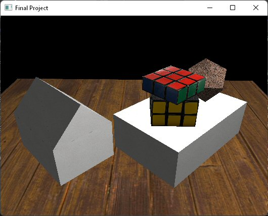
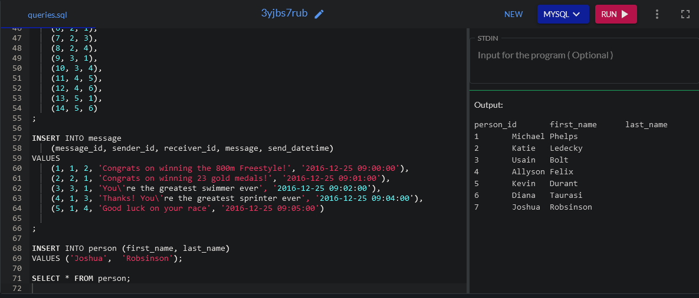
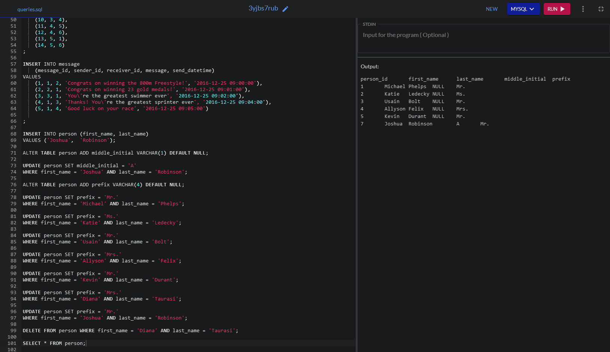
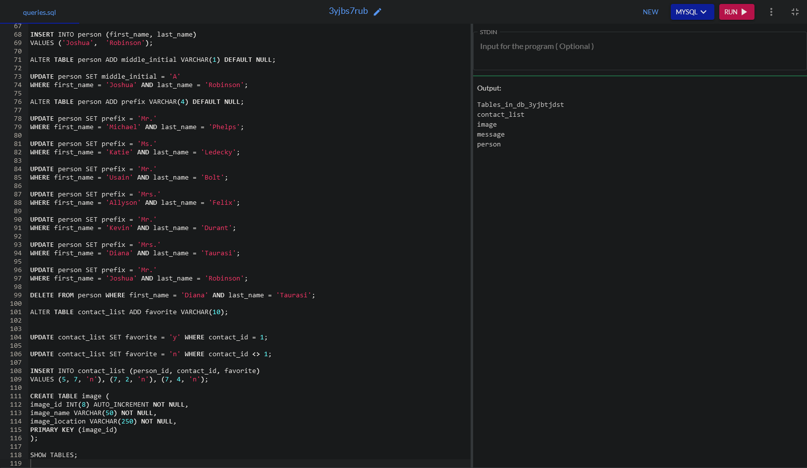
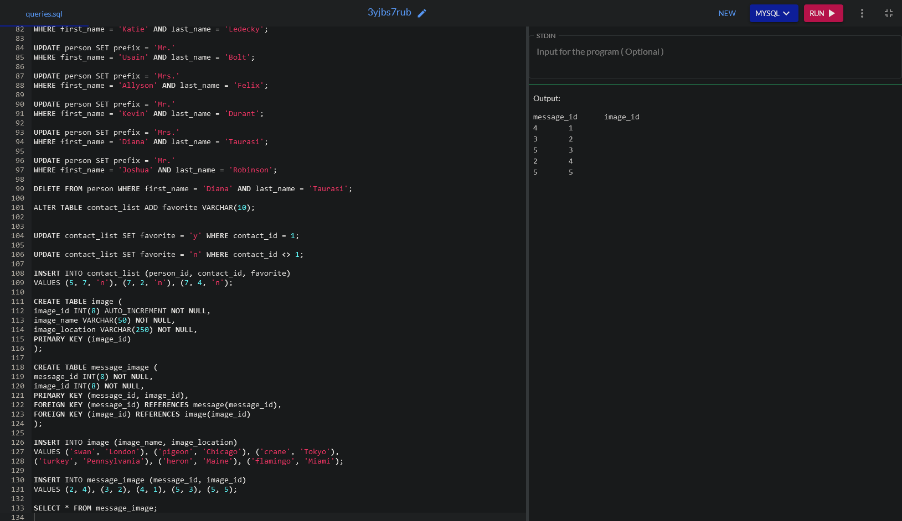
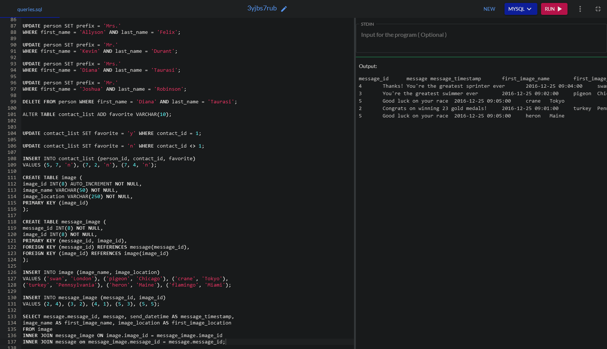

# Code Review

[Code review link](https://youtu.be/NE0OZ7xVRnQ)

# Milestone Two: Enhancement One: Software Design and Engineering

[CS-330 Final Project code](https://github.com/jrobin85/jrobin85.github.io/blob/master/Final%20Project.cpp)

[Milestone Two narrative](https://github.com/jrobin85/jrobin85.github.io/blob/master/3-2%20Milestone%20Two-%20Enhancement%20One%20Sotware%20Design%20and%20Engineering.docx)

 

# 4-2 Milestone Three: Enhancement Two: Algorithms and Data Structure

[IT-145 Final Project code](https://github.com/jrobin85/jrobin85.github.io/tree/master/IT-145_Final_Project_Authentication/Authenticate)

[Milestone Three narrative](https://github.com/jrobin85/jrobin85.github.io/blob/master/CS%20499%20Milestone%20Three%20Narrative.docx)

# 5-2 Milestone Four: Enhancement Three: Databases

[DAD-220 Final Project code](https://github.com/jrobin85/jrobin85.github.io/blob/master/DAD-220_Commands.txt)

[Milestone Four narrative](https://github.com/jrobin85/jrobin85.github.io/blob/master/7-1%20Final%20Project-%20Database%20Management%20ReportTAKENFROMWEB.docx)

             
